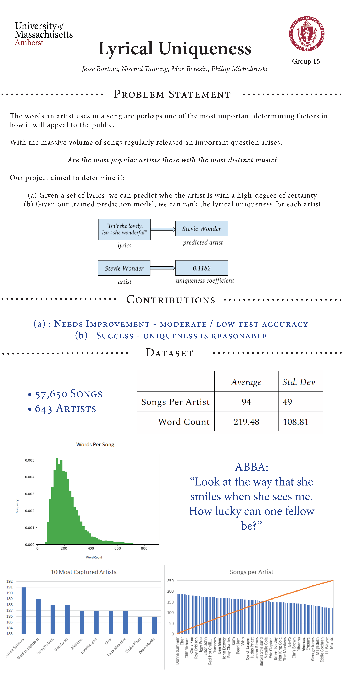
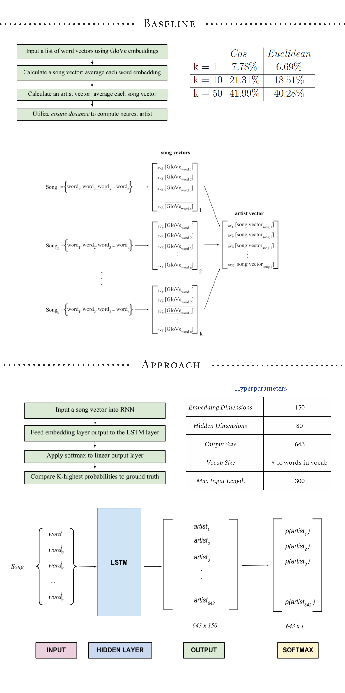
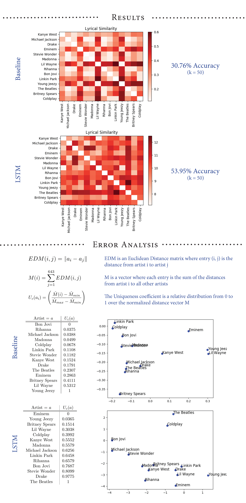

# Lyrical Distinction &middot; [](https://travis-ci.org/npm/npm) [](https://www.npmjs.com/package/npm)

> Analyzing Musical Artists from representations of their lyrics  
 

## Running the Model

To run the model: 
```
python model/learner.py
```

If no argument is specified, learner creates a serialized object of the dictionary that is created from the CSV embeddings. 

```
python model/learner.py -r
```

If an argument is specified, learner reads from a serialized object instead of reconstructing the dictionary from the CSV. 
Note: We are serializing and saving the csv embeddings so that we don't have to recompute the dictionary as we change and test various hyperparameters. 

---

## Presentation Poster






